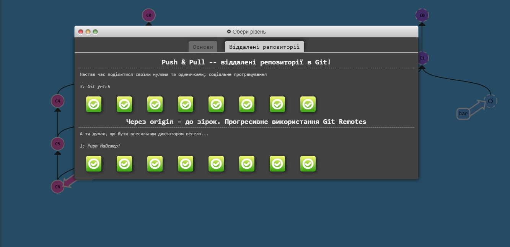

# kottans-frontend

==================

## <h1>Git та GitHub</h1>

It was very useful and interesting information. I have studied a lot of git comands. Some of them I have already used. And a lot of I plan to use in the future.

## Linux CLI, and HTTP

---

I had practical experience with the console, used basic commands, for example, _"ls"_,_"mkdir"_ and _'cd'_. There were many new things in the course, in particular, _"grep"_, redirection of input and output, which seemed very convenient to me and now I try to use it in practice, setting up the environment. It was difficult with bash scripts, but I won :smile:
On http, in addition to articles, I watched additional materials on YouTube, figured it out.

